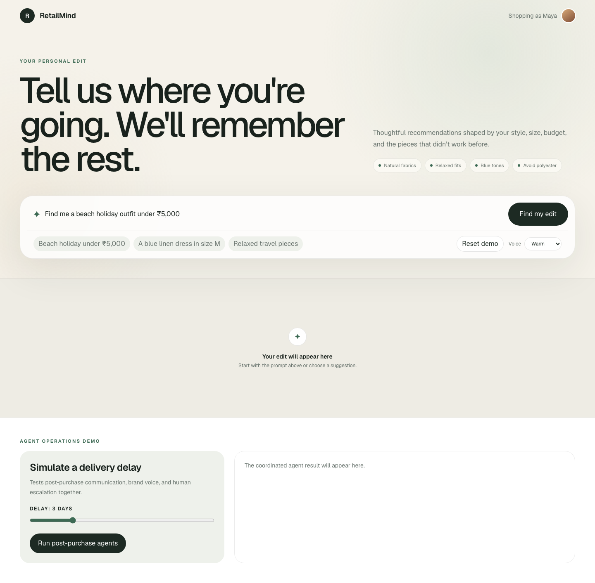
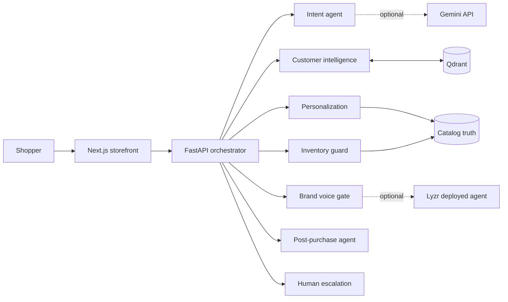

# RetailMind

[](https://github.com/sinha4/RetailMind/actions/workflows/ci.yml)
[](https://github.com/sinha4/RetailMind/actions/workflows/codeql.yml)


RetailMind is an explainable, memory-driven retail agent system. It turns a natural-language
shopping request into grounded recommendations, learns from purchases and returns, changes future
rankings, communicates delivery delays, and escalates uncertain cases to a person with context.

The core demo is intentionally safe and repeatable: Gemini extracts structured intent, a deployed
Lyzr Studio agent prepares the brand-consistent response, and Qdrant persists attributable memory.
Prices, inventory, ranking, return learning, and escalation remain deterministic. If an AI provider
fails, the same journey completes through a visible validated fallback.



## Why it stands out

- **Persistent customer intelligence:** explicit, attributable memory facts stored in Qdrant.
- **Negative-signal learning:** return reasons create product and material avoidances that affect the
  next ranking.
- **Grounded recommendations:** every result is in stock, within constraints, scored, and explained.
- **Multi-agent orchestration:** intent, customer intelligence, personalization, inventory,
  brand voice, post-purchase, and human-escalation steps are traced separately.
- **Real dual-provider orchestration:** Gemini handles structured intent and a deployed Lyzr agent
  handles presentation, with provider names and latency visible in the trace.
- **Safe model boundary:** provider-neutral adapters, structured output validation, timeouts, prompt
  versions, latency metadata, and deterministic fallbacks.
- **Operational demo:** delivery delays trigger proactive communication and threshold-based human
  escalation.
- **Engineering quality:** 25 backend tests at 88% coverage, frontend component tests at 100% line
  coverage, CI, CodeQL, Dependabot, structured logs, typed contracts, and production builds.

## Architecture



See [the architecture document](docs/architecture.md) for boundaries, API routes, data flow, safety
decisions, and failure behavior.

## Repository structure

```text
apps/
  api/        FastAPI orchestration, agents, domain models, Qdrant adapter, tests
  web/        Next.js storefront, learning journey, operations demo, component tests
packages/
  contracts/  Provider-neutral TypeScript contracts
docs/         Architecture, testing, operations, roadmap, and recording script
.github/      CI, CodeQL, and dependency automation
```

## Quick start

Prerequisites: Node.js 22+, Python 3.12, and optionally Docker.

```bash
git clone https://github.com/sinha4/RetailMind.git
cd RetailMind
cp .env.example .env
npm install
python3.12 -m venv .venv
.venv/bin/pip install -e 'apps/api[dev,agents]'
```

Add the provider credentials to `.env` for live AI steps. The full product works without them.

```env
GEMINI_API_KEY=your_key_here
GEMINI_MODEL=gemini-3.1-flash-lite
LYZR_API_KEY=your_lyzr_key_here
LYZR_AGENT_ID=your_deployed_agent_id
```

Create and deploy the presentation agent in [Lyzr Studio](https://studio.lyzr.ai), then copy its
Agent ID from the deployment/API panel. Configure it to produce one short retailer greeting without
inventing price, stock, size, material, quantity, or policy facts. With both providers configured,
the trace shows `google-gemini` for intent and `lyzr-agent` for brand voice.
The exact role, goal, guardrails, and test cases are in the [Lyzr setup guide](docs/lyzr-setup.md).

Start the API and web app in separate terminals:

```bash
PYTHONPATH=apps/api/src .venv/bin/python -m uvicorn retailmind_api.main:app \
  --host 127.0.0.1 --port 8000 --reload --reload-exclude '.venv/**'
```

```bash
npm run dev:web
```

Open [http://localhost:3000](http://localhost:3000). Interactive API documentation is available at
[http://localhost:8000/docs](http://localhost:8000/docs).

By default, local development uses embedded Qdrant in the ignored `qdrant_storage/` directory. For
a Qdrant server, run `docker compose up -d qdrant` and set `QDRANT_URL=http://localhost:6333`.

For a reproducible containerized stack, run `docker compose up --build`; Qdrant, the API, and the
web app start with health-ordered dependencies on ports 6333, 8000, and 3000.

## Repeatable demo journey

1. Click **Reset demo**.
2. Ask: `Find me a beach holiday outfit under INR 5,000`.
3. Inspect grounded recommendations, metrics, and the agent trace.
4. Return a product with a material-related reason.
5. Show the changed preference memory and **Before vs after learning** ranking.
6. Run three-day and eight-day delays in **Agent operations demo**.
7. Show that only the long delay requests human help.

For a polished recording, follow the [three-minute demo script](docs/demo-script.md).

## Quality gates

```bash
npm run verify
```

This runs formatting, TypeScript, ESLint, backend and frontend tests with coverage thresholds, and a
production Next.js build. CI additionally runs dependency audits and uploads coverage artifacts.

| Quality signal                   | Current result                                        |
| -------------------------------- | ----------------------------------------------------- |
| Backend tests                    | 25 passing                                            |
| Backend coverage                 | 88% across 648 statements; minimum 85%                |
| Frontend component tests         | 4 passing                                             |
| Selected component line coverage | 100%; branch minimum 80%                              |
| TypeScript and ESLint            | Passing                                               |
| Python Ruff                      | Passing                                               |
| Production web build             | Passing                                               |
| Security automation              | CodeQL, Dependabot, npm high-severity gate, pip audit |

See [testing](docs/testing.md), [operations](docs/operations.md), [security](SECURITY.md), and
[contributing](CONTRIBUTING.md) for the evidence behind these claims.

## API surface

| Method | Endpoint                     | Purpose                                        |
| ------ | ---------------------------- | ---------------------------------------------- |
| `GET`  | `/health`, `/ready`          | Service health and readiness                   |
| `GET`  | `/metrics`                   | Prometheus request, error, and latency metrics |
| `GET`  | `/v1/products`               | Filtered catalog truth                         |
| `GET`  | `/v1/customers/{id}/context` | Profile and attributable memories              |
| `POST` | `/v1/conversations/messages` | Coordinated shopping turn                      |
| `POST` | `/v1/events`                 | Learn from skip, save, purchase, or return     |
| `GET`  | `/v1/customers/{id}/events`  | Auditable customer event history               |
| `GET`  | `/v1/brands`                 | Brand-manager voice profiles                   |
| `POST` | `/v1/orders/delivery-delay`  | Delay communication and escalation             |
| `POST` | `/v1/demo/reset`             | Restore the repeatable demo baseline           |

## Responsible AI and privacy

- Gemini and Lyzr never own price, stock, ranking, customer memory, or policy truth.
- Model outputs are validated; unsafe or unavailable output triggers an explicit fallback trace.
- Customer facts retain source, confidence, evidence, timestamp, and product attribution.
- Secrets, request bodies, and customer messages are excluded from logs and Git.
- Human escalation includes only the context required for support.

## License

MIT - see [LICENSE](LICENSE).
