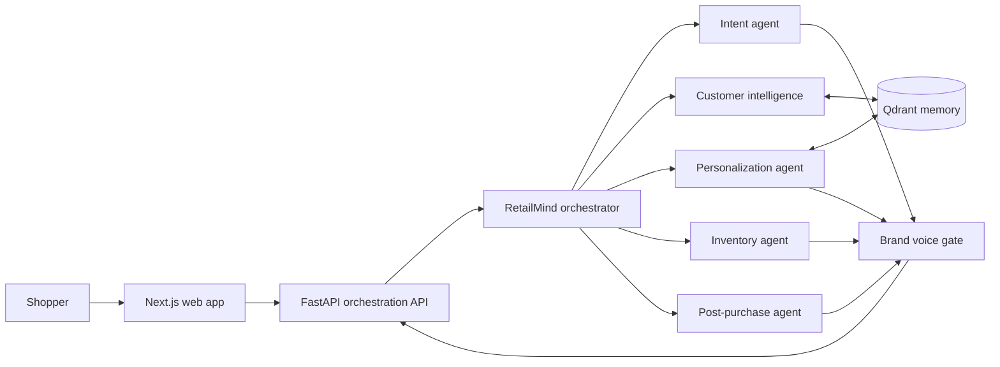

# Architecture

## Product flow

## Boundaries

- **Web app:** customer chat/discovery experience, recommendation cards, explanations, and later a brand-manager view.
- **API:** stable HTTP boundary, request validation, orchestration, observability, and human escalation.
- **Domain layer:** provider-neutral customer signals, memory facts, intents, products, recommendations, and agent results.
- **Adapters:** Google ADK, Lyzr, Qdrant, catalog, inventory, and order providers. Business logic must not import provider SDKs directly.
- **Brand voice gate:** the final customer-facing generation step. Internal facts and rankings remain structured so rewriting cannot alter price, stock, or policy claims.

## Initial API surface

| Method | Path                                  | Purpose                                |
| ------ | ------------------------------------- | -------------------------------------- |
| GET    | `/health`                             | Liveness and service identity          |
| GET    | `/ready`                              | Dependency readiness (expanded later)  |
| GET    | `/v1/products`                        | List and filter catalog products       |
| GET    | `/v1/products/{product_id}`           | Retrieve authoritative product details |
| GET    | `/v1/customers/{customer_id}/context` | Retrieve profile and memory facts      |
| POST   | `/v1/conversations/messages`          | Future orchestrated shopping turn      |
| POST   | `/v1/events`                          | Future customer signal ingestion       |

## Key implementation decisions

1. Keep customer memory as explicit, attributable facts rather than opaque conversation summaries.
2. Store positive and negative signals separately with confidence, timestamp, and source.
3. Require recommendation agents to return structured product IDs, scores, and reasons before brand rewriting.
4. Keep catalog truth, inventory, prices, and policies outside the language model.
5. Add tracing at the orchestrator boundary so every recommendation is explainable during the demo.
